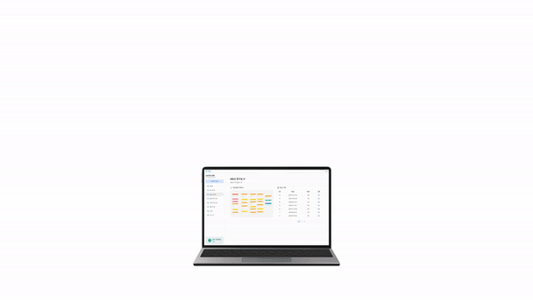

# AI BLOCK EDITOR, ABLE 👨‍💻

  

## 📅 프로젝트 정보

### SSAFY 11기 2학기 자율 프로젝트

2024.10.14(월) ~ 2024.11.19(화) [5주]

 

## 📖 주제

**블록 코딩** 방식의 **AI 모델** 개발 소프트웨어

- 🤖 손쉬운 AI 모델 개발
- 📊 한 눈에 보이는 모델 분석
- 🚀 간편한 배포

## 📝 주요 기능
### 📚 사용자 가이드 제공
ABLE은 **처음 사용하는 사용자에게 편의성을 제공**해주기 위해 사용자 가이드(Docs)를 제공합니다.

   

| 사용자 가이드 조회 |
| :---: |
|  |

   

### 🧩 블록 코딩
ABLE은 **블록을 활용한 직관적인 시각적 인터페이스**를 통해 사용자들이 딥러닝 모델을 설계할 수 있도록 돕습니다. 데이터 전처리, 레이어 추가, 활성화 함수 선택 등 다양한 작업을 **유연하게 수행**할 수 있으며, 설계 과정을 간소화해 효율성을 극대화합니다. 결과적으로 **직관적 설계, 유연한 조합, 효율적 관리**를 통해 모델 설계에 집중할 수 있는 최적의 환경을 제공합니다.

   

| 블록 조회 | 블록 추가 |
| :---: | :---: |
|  |  |

| 블록 연결 | 블록 삭제 |
| :---: | :---: |
|  |  |

   

### ✅ 유효성 검증
ABLE은 유효성 검증 기능을 통해 **블록 코딩 작업의 안정성을 보장**합니다. 사용자가 블록을 연결할 때 **연결성을 자동으로 확인**하며, 모델 구성 과정에서 **순환(cycle) 생성 방지**를 통해 **설계 오류를 사전에 차단**합니다. 이를 통해 정확하고 신뢰성 있는 모델 설계를 지원합니다.

 

| 연결성 확인 | 순환 생성 방지 |
| :---: | :---: |
|  |  |

 

### ✏ 모델 학습
ABLE은 사용자가 생성한 블록 모델을 통해 **효율적인 자동화 학습 프로세스**를 제공합니다.
학습 과정은 **데이터 전처리, 모델 구성, 손실 함수 및 최적화 설정, 학습 실행, 결과 저장** 등의 단계를 포함하며, 모든 과정을 체계적으로 관리합니다.

- 자동화된 학습 실행 및 로깅
  - 학습 요청이 들어오면 ABLE은 연결된 블록을 바탕으로 모델을 생성하고,   데이터를 전처리하며 학습을 진행합니다. 학습 중에는 각 에포크의 정확도, 손실, 모델 체크포인트를 기록하고 최적의 모델을 저장합니다.

- 모델 평가 및 결과 시각화
  - 학습 완료 후 테스트 데이터셋을 사용해 모델을 평가하고, 혼동 행렬, 정확도, F1-스코어 등의 결과를 생성합니다. 혼동 행렬 시각화와 성능 지표 저장을 통해 학습 결과를 명확히 확인할 수 있습니다.

- 결과 저장 및 관리
  - 학습 중 생성된 전처리 파이프라인, 메타데이터, 하이퍼파라미터, 모델 그래프, 학습 결과 파일 등은 자동으로 관리 및 저장되어 사용자가 추후 쉽게 활용할 수 있도록 지원합니다.

   

| 학습 시작 및 결과 조회 |
| :-------------------: |
|  |

   

### 🔎 모델 분석
ABLE은 사용자가 학습을 완료한 **딥러닝 모델을 직관적이고 간편하게 테스트**할 수 있는 기능을 제공합니다. 다음과 같은 세부 기능을 통해 모델의 **내부 동작 과정을 이해**하고, **성능을 분석**하며, **최적화를 위한 인사이트**를 제공하는 데 도움을 줍니다.

- 이미지 업로드 및 추론
  - 사용자는 단일 이미지를 업로드하여 버튼 클릭만으로 모델 추론을 수행할 수 있습니다.

- 피처맵 시각화
  - 각 레이어 블록의 피처맵을 통해 모델이 입력 데이터를 어떻게 변환하며 특징을 추출하는지 세부적인 필터링 과정을 확인할 수 있습니다.

- 히트맵 분석
  - 마지막 활성화 함수 블록에서는 히트맵 시각화를 통해 이미지의 특정 영역이 모델의 분류 결정에 어떻게 기여했는지 명확히 확인할 수 있습니다.

   

| 분석 시작 및 결과 조회 |
| :------------------: |
|  |

   

### 🚀 모델 배포
ABLE은 **버튼 클릭만으로 FastAPI 프레임워크 기반의 서버를 실행**하고, **실시간 로그 확인 기능**을 제공합니다. 또한, 사용자가 생성한 모델을 API로 생성하여 **모델 배포 및 활용을 손쉽게 지원**합니다.

- 손쉬운 배포 및 관리
  - 사용자는 간단한 인터페이스를 통해 서버를 실행하거나 종료할 수 있으며, API를 추가 및 삭제하거나 배포된 API 목록을 조회할 수 있습니다. 이를 통해 **사용자가 만든 모델을 쉽고 빠르게 배포하고 활용**할 수 있습니다.

   

| 서버 시작 및 로그 조회 | 서버 종료 |
| :---: | :---: |
|  |  | 

| API 추가 및 목록 조회 | API 삭제 |
| :---: | :---: |
|  |  |

 

## ⚒️ 기술 스택

### 🖥️ Common

|               |                                                                                                                                                                                                                                                                                                                                                                                                                                                                                 |
| :------------ | :------------------------------------------------------------------------------------------------------------------------------------------------------------------------------------------------------------------------------------------------------------------------------------------------------------------------------------------------------------------------------------------------------------------------------------------------------------------------------ |
| Collaboration |     |

 

### 🖥️ Server

|                 |                                                                                                                                                                                                                                            |
| :-------------: | :----------------------------------------------------------------------------------------------------------------------------------------------------------------------------------------------------------------------------------------- |
|    Framework    |                                                                                                                                   |
|    Language     |                                                                                                                                 |
|     DevOps      |   |
| Version Control |                                    |
|       IDE       |                                                                                                                               |

 

### 🖥️ Client

|                  |                                                                                                                                                                                                                             |
| :--------------- | :-------------------------------------------------------------------------------------------------------------------------------------------------------------------------------------------------------------------------- |
| Framework        |                                                                                                                         |
| Language         |                                                                                                              |
| Styling          |                                                                                                                     |
| State Management |   |
| Version Control  |                     |
| IDE              |                                                                                            |

 

## 📚 산출물

|                |                          |
| :------------: | -----------------------: |
| File Structure |  |

## 🧑🏻  팀원

<table border="1" style="border-collapse: collapse; text-align: center; width: 100%;">
    <tr>
      <th scope="col" colspan="4" style="text-align: center; background-color: #ADD8E6; color: #FFF;"> Server </th>
      <th scope="col" colspan="2" style="text-align: center; background-color: #C6ABFF; color: #FFF;"> Client </th>
    </tr>
    <tr>
      <td style="text-align: center; background-color: #ADD8E6; color: #FFF;">박근석</td>
      <td style="text-align: center; background-color: #ADD8E6; color: #FFF;">박다솔</td>
      <td style="text-align: center; background-color: #ADD8E6; color: #FFF;">박상후</td>
      <td style="text-align: center; background-color: #ADD8E6; color: #FFF;">박찬규</td>
      <td style="text-align: center; background-color: #C6ABFF; color: #FFF;">정다빈</td>
      <td style="text-align: center; background-color: #C6ABFF; color: #FFF;">조민주</td>
    </tr>
    <tr>
      <td>
        
      </td>
      <td>
        
      </td>
      <td>
               
      </td>
      <td>
        
      </td>
      <td>
        
      </td>
      <td>
          
      </td>
    </tr>
</table>
