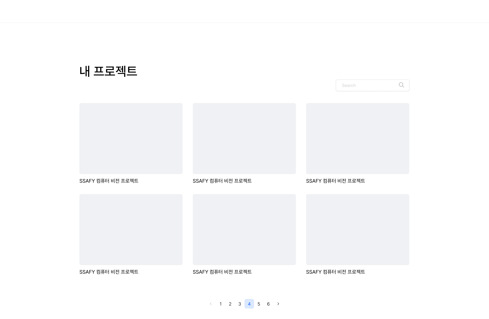
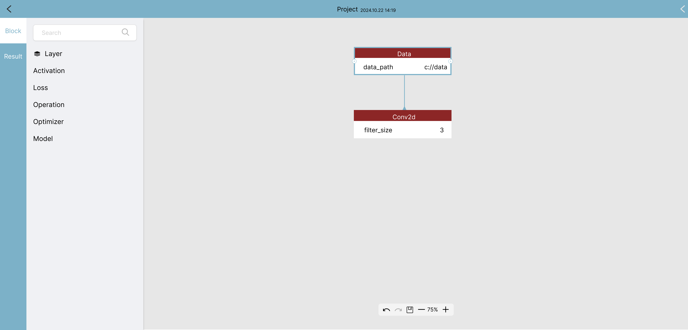
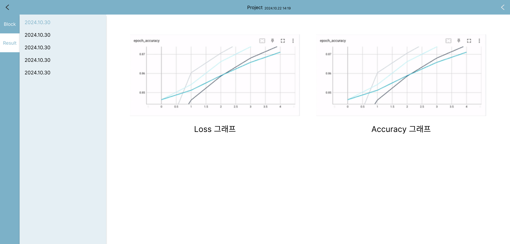
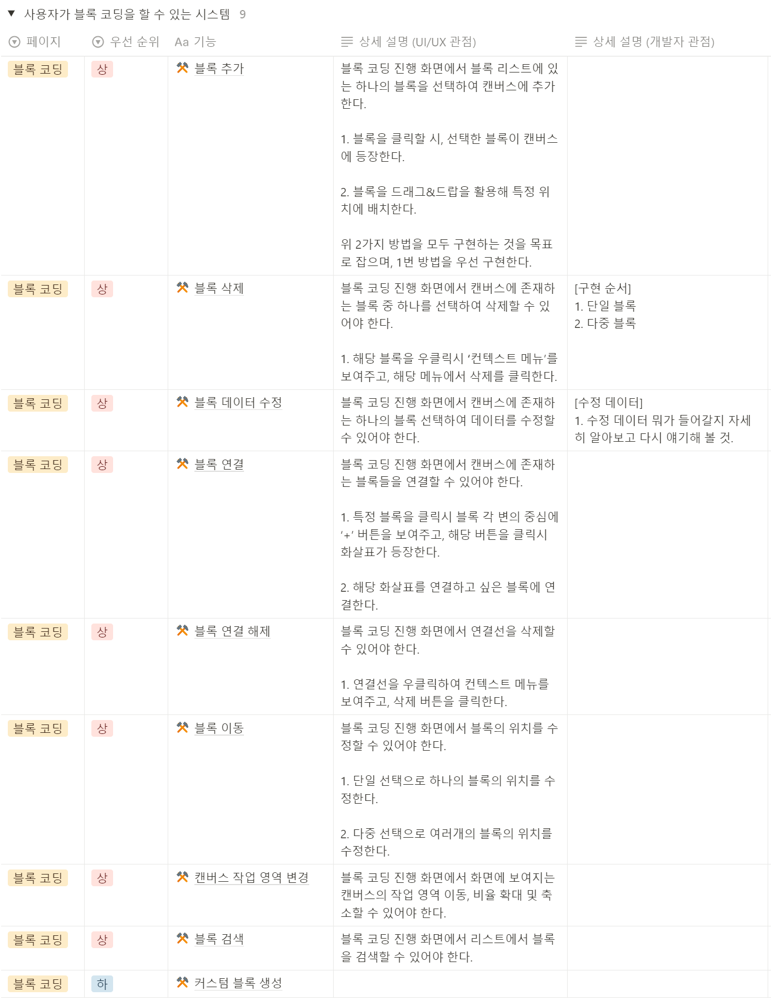
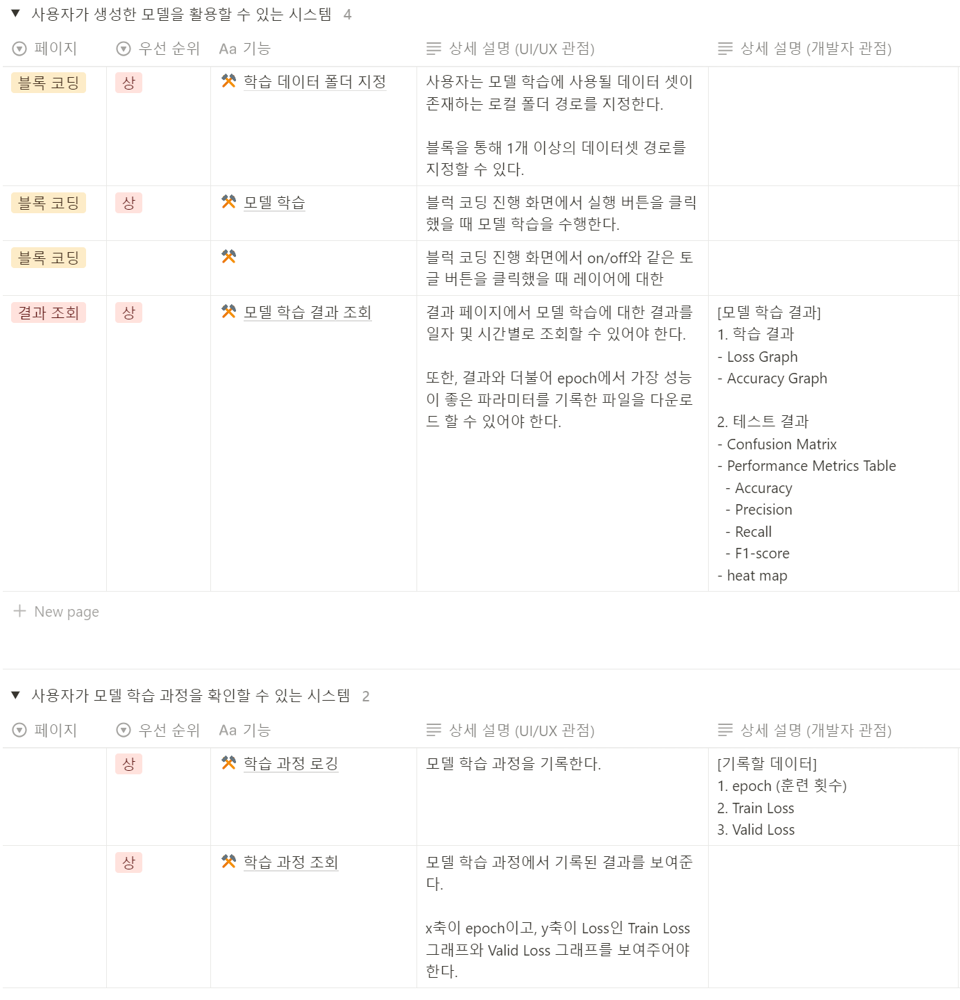

# 🙌 아이디어 회의 | 📅 10.14 (월)
### 1. 블럭코딩 기반 AI 모델 생성 서비스

1. 주제 적합성: 중
    - 사용자는 블럭을 배치만 하면 이를 AI 모델 형태로 제공받아 쉽게 테스트, validation, 공유할 수 있다.

2. 개발 난이도: 하
    - 단순히 블럭을 배치하고 파라미터를 설정하고 이를 기반으로 모델을 만들어주는 플로우로는 볼륨이 작음.

3. 창의성: 상
    - AI 개발 입문자들에게 교육용 솔루션이 될 것이라 예상.

 

# 📌 주제 구체화 | 📅 10.17 (목)
## 주제
🧱 블록 코딩을 기반으로 AI 모델 생성 및  학습 지원 도구

### ❓ 왜 필요한가?
---

#### 구조 변경의 어려움과 시각적 관리 필요

AI 모델을 만들 때 필요한 레이어(예: ReLU, Linear, Conv, Pool 등)는 이미 정해져 있지만, 이 레이어들을 어떻게 배치하는지가 모델 성능에 큰 영향을 미칩니다. 기존에는 코드로만 이러한 구조를 조작하다 보니, 전체적인 모델 구조가 제대로 구현됐는지 확인하기 어려웠습니다. 블록 코딩을 사용하면 시각적인 접근이 가능해, 원하는 모델 구조를 직관적으로 확인할 수 있습니다.

#### 실시간 유효성 검증의 필요성

AI 모델 개발에서는 레이어의 순서뿐 아니라 각 파라미터(예: 레이어 크기, 활성화 함수의 종류 등)도 중요합니다. 파라미터 값이 잘못되면 실행 중에 오류가 발생하는데, 기존에는 이러한 오류를 런타임에서만 알 수 있었습니다. 블록 코딩 기반 도구는 블록을 추가할 때마다 유효성을 즉시 검증해주어, 코드 작성 중에 발생할 수 있는 오류를 사전에 방지할 수 있습니다.

#### 드래그앤드롭 방식의 편리함

코드를 일일이 작성하는 대신, 드래그앤드롭으로 모델을 구성할 수 있다면 개발자들이 더욱 빠르고 효율적으로 모델을 만들 수 있습니다. 이 도구는 AI 모델 생성 과정을 시각적이면서도 직관적으로 만들어 주어, 복잡한 구조도 간편하게 설계할 수 있게 해줍니다.

#### 학습과정 시각화

> [Tensorflow - Neural Network Playground](https://playground.tensorflow.org/#activation=tanh&batchSize=10&dataset=spiral&regDataset=reg-plane&learningRate=0.03&regularizationRate=0&noise=0&networkShape=7,2&seed=0.43549&showTestData=false&discretize=false&percTrainData=50&x=true&y=true&xTimesY=true&xSquared=true&ySquared=true&cosX=false&sinX=false&cosY=false&sinY=false&collectStats=false&problem=classification&initZero=false&hideText=false)

AI 모델 학습은 그 과정이 복잡하고 추상적이어서, 초심자들에게는 쉽게 다가오기 어려울 수 있습니다. AI 모델이 데이터를 어떻게 처리하고, 학습을 통해 성능을 개선해 나가는지를 직관적으로 이해하기 위해서는 시각화가 필요하다고 생각했습니다.

 

# 📌 주제 구체화 | 📅 10.18 (금)
## 주제
🧱 블록 코딩을 기반으로 AI 모델 생성 및  학습 지원 도구

## 🙋‍♂️ 예상 사용자

### 초심자에게 어떤 사용자 경험이 필요할까?

<aside>

여기서 말하는 초심자는 **대학교에 3/4학년으로 재학중인 학부생**을 말하며, 이제 막 AI 관련 전공 수업을 듣거나 프로젝트를 진행하며 **AI 모델 생성 및 학습에 관심을 가지는 단계에 있는 학생**으로 정의한다.

</aside>

→ 런타임이 아닌 **실시간으로 모델에 대한 유효성을 검사**를 도와주자

→ **GUI를 통해 모델을 설계**할 수 있도록 도와주자

→ 모델 학습을 지원해주고 **학습 과정을 추적하여 이를 시각화**하여 보여주자

→ 사용자에게 데이터를 받아 모델 수행 결과를 보여주자

→ 한마디로 정리하자면, AI 모델을 생성하고 학습하는 과정을 지원해주자

## 🙋‍♂️ 사용자 시나리오

### 유입

**1. AI 모델 학습에 대한 흥미와 첫 걸음**

- 사용자들은 AI 관련 전공 수업을 통해 AI 모델링에 흥미를 느끼고, 프로젝트 과제나 개인적인 관심으로 AI 모델을 직접 만들어보고자 하는 동기를 가지게 됩니다.
- 기존에 단순히 개념적으로 이해했던 내용을 실제 코드로 구현해보려는 시도를 하게 됩니다.

**2. 검색 및 접근**

- 검색 과정을 통해 단순 모델 설계뿐만 아니라 학습까지 지원하고 이를 시각화하여 보여주는 도구가 있다는 것을 알게 되어, 기대감을 갖고 해당 서비스에 접근하게 됩니다.

### 서비스 사용

**1. 모델 구성 및 파라미터 설정**

- 드래그 앤 드롭으로 레이어를 배치하고, 각 블록의 파라미터를 조정합니다. 실시간 유효성 검증 기능을 통해 오류를 사전에 수정합니다.

**2. 모델 학습 및 시각화 체험**

- 학습을 시작하고, 그래프와 시각적 요소를 통해 모델의 성능이 어떻게 개선되는지 추적합니다.

**3. 결과 분석 및 모델 조정**

- 학습 결과를 분석하고, 필요하면 모델을 재구성하거나 파라미터를 수정하여 재학습을 시도합니다.

**4. 최종 모델 저장 및 온-디바이스 테스트**

- 사용자는 모델을 저장하기 전, 온-디바이스 테스트 기능을 이용해 모델이 실제 환경에서 잘 작동하는지 확인합니다.
- 테스트 결과를 기반으로 모델이 기대대로 작동하는 것을 확인한 후, 최종 저장을 진행합니다.

## ✨ 기대 효과

### 모델 개발의 진입 장벽 하락

초심자들은 AI 모델 개발 과정에서 코드 작성이 복잡하게 느껴질 수 있습니다. 블록 코딩 방식은 코딩을 시각적이고 이해하기 쉽게 만들어주어, 모델 개발의 진입 장벽을 낮출 수 있습니다.

### 실시간 피드백 제공을 통한 오류 사전 예방

초심자들은 파라미터 설정에서 발생할 수 있는 오류를 사전에 예방하는 데 도움을 받을 수 있습니다. 블록을 추가할 때마다 실시간으로 유효성 검증이 이루어지므로, 즉각적인 피드백을 통해 학습할 수 있습니다.

### 단계별 학습 가능

블록 코딩 방식은 레이어와 파라미터를 개별 블록으로 나누어 접근할 수 있어, AI 모델 구조와 각 요소의 역할을 직관적으로 배울 수 있게 도와줍니다. 드래그앤드롭 방식은 간단한 구조부터 시작하여 점차 복잡한 모델로 확장해가는 데에도 유리합니다.

 

# 🔧 기능 명세서 | 📅 10.21 (월)

## 사용자가 블록 코딩을 할 수 있는 시스템

**1. 블록 추가**

    블록 리스트에 있는 하나의 블록을 선택하여 캔버스에 추가한다. 

    1-1. 블록을 클릭할 시, 선택한 블록이 캔버스에 등장한다.

    1-2. 블록을 드래그&드랍을 활용해 특정 위치에 배치한다.

**2. 블록 삭제**

    캔버스에 존재하는 블록 중 하나를 선택하여 삭제한다.

    2-1. 해당 블록을 우클릭시 ‘컨텍스트 메뉴’를 보여주고, 해당 메뉴에서 삭제를 클릭한다. 

**3. 블록 데이터 수정**

    캔버스에 존재하는 선택한 하나의 블록 데이터를 수정한다.

**4. 블록 연결**

    캔버스에 존재하는 블록들을 연결한다.

    4-1. 특정 블록을 클릭시 블록 각 변의 중심에 ‘+’ 버튼을 보여주고, 해당 버튼을 클릭시 화살표가 등장한다. 

    해당 화살표를 연결하고 싶은 블록에 연결한다.

**5. 블록 연결 해제**

    연결선을 삭제한다.

    5-1. 연결선을 우클릭하여 컨텍스트 메뉴를 보여주고, 삭제 버튼을 클릭한다.

**6. 커스텀 블록 생성**

 

## 사용자가 모델을 검증할 수 있는 시스템

**1. 모델 파라미터 검증**

    연결된 블록들의 파라미터 유효성을 검증한다.

**2. 모델 사이클 발생 여부 확인**

    블록들의 사이클 발생 여부를 체크한다.

**3. 사용하지 않는 블록 표시**

    최상위 블록에서 시작되지 않은 블록에 대해서 투명도를 통해 구분한다.

    3-1. 블록은 최상위 블록과의 연결 상태를 기록하고 있다.

    3-2. A블록이 최상위 블록일 경우라면 무조건 참으로 설정한다.

    3-3. 아니라면 A블록을 B블록과 연결할 때 A블록의 최상위 블록과 연결 상태를 확인하여 B블록의 상태를 동일한 상태로 갱신한다.

 

# 🖥 와이어프레임 | 📅 10.22 (화)

**1. 랜딩 페이지**

 

**2. (메인) 캔버스**

 

**3. 학습 결과**

 

# 🖥 명세서 수정 & 발표 자료 제작 | 📅 10.23 (수)

## 1. 요구사항 명세서

 

 

## 2. 발표 자료 제작

 

 

# 🖥 모듈 목록 명세 | 📅 10.24 (목)

## 1. 프로젝트

 

## 2. 블록 코딩

 

## 3. 학습

 

 

# 🖥 모듈 목록 명세 | 📅 10.25 (금)

## 1. 모델 검증

 

## 2. 에포크별 분석

 

