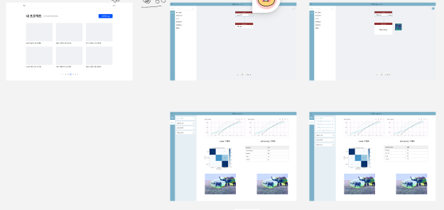
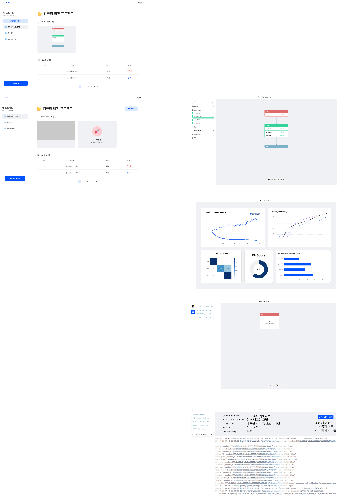
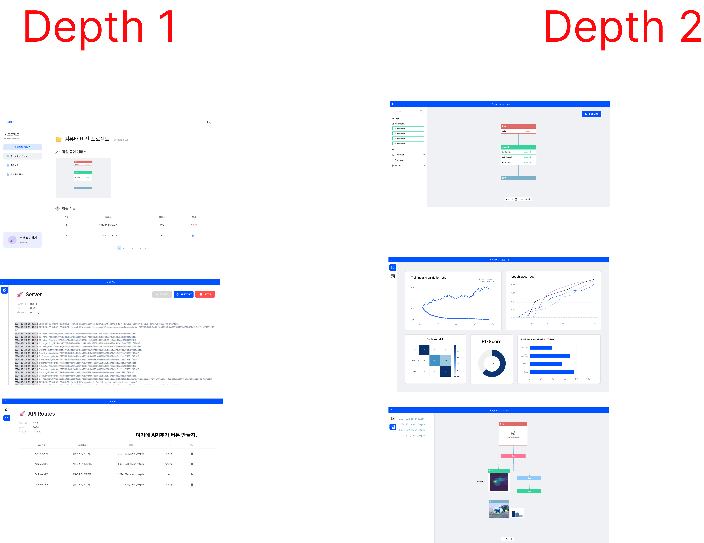

# 🙌 아이디어 회의 | 10.14(월)

## 1. 블록코딩 기반 AI 모델 생성 서비스

1. 주제 적합성: 중
   - 사용자는 블럭을 배치만 하면 이를 AI 모델 형태로 제공받아 쉽게 테스트, validation, 공유할 수 있다.
2. 개발 난이도: 하
   - 단순히 블럭을 배치하고 파라미터를 설정하고 이를 기반으로 모델을 만들어주는 플로우로는 볼륨이 작음.
3. 창의성: 상
   - AI 개발 입문자들에게 교육용 솔루션이 될 것이라 예상.

 

# 🙌 팀미팅 | 10.17(목)

## 🧱 블록 코딩 기반 AI 모델 생성 및 학습 지원 도구

### **구조 변경의 어려움과 시각적 관리 필요**

AI 모델을 만들 때 필요한 레이어(ReLU, Linear, Conv, Pool 등)는 이미 정해져 있지만, 이 레이어들을 어떻게 배치하는지가 모델 성능에 큰 영향을 미칩니다. 기존에는 코드로만 이러한 구조를 조작하다 보니, 전체적인 모델 구조가 제대로 구현됐는지 확인하기 어려웠습니다. 블록 코딩을 사용하면 시각적인 접근이 가능해, 원하는 모델 구조를 직관적으로 확인할 수 있습니다.

### **실시간 유효성 검증의 필요성**

AI 모델 개발에서는 레이어의 순서뿐 아니라 각 파라미터(레이어 크기, 활성화 함수의 종류 등)도 중요합니다. 파라미터 값이 잘못되면 실행 중에 오류가 발생하는데, 기존에는 이러한 오류를 런타임에서만 알 수 있었습니다. 블록 코딩 기반 도구는 블록을 추가할 때마다 유효성을 즉시 검증해주어, 코드 작성 중에 발생할 수 있는 오류를 사전에 방지할 수 있습니다.

### **드래그 앤 드롭 방식의 편리함**

코드를 일일이 작성하는 대신, 드래그 앤 드롭으로 모델을 구성할 수 있다면 개발자들이 더욱 빠르고 효율적으로 모델을 만들 수 있습니다. 이 도구는 AI 모델 생성 과정을 시각적이면서도 직관적으로 만들어 주어, 복잡한 구조도 간편하게 설계할 수 있게 해줍니다.

### 학습 과정 시각화

AI 모델 학습은 그 과정이 복잡하고 추상적이어서 초심자들이 이해하기 어려울 수 있습니다.
특히, 아래 사진과 같이 배열 형태의 숫자 데이터가 Feature Map과 같은 의미를 지닌다는 것을 직관적으로 파악하기가 어렵습니다. 이를 보완하기 위해, AI 모델이 데이터를 어떻게 처리하고 학습을 통해 성능을 개선해 나가는지 시각적으로 표현하는 것이 필요하다고 생각했습니다.

 

# 🙌 기능 명세서 작성 | 10.21(월)

### 사용자가 블록 코딩을 할 수 있는 시스템

- 블록 추가
- 블록 삭제
- 블록 데이터 수정
- 블록 연결
- 블록 연결 해제
- 커스텀 블록 생성

### 사용자가 모델을 검증할 수 있는 시스템

- 모델 파라미터 검증
- 모델 사이클 발생 여부 확인
- 사용하지 않는 블록 표시

### 사용자가 모델 학습 관련 기능을 진행할 수 있는 시스템

- 학습 데이터 폴더 지정
- 모델 학습
- 학습 결과 조회

### 사용자가 학습한 모델을 테스트한 결과를 조회할 수 있는 시스템

- 학습을 진행한 모델 테스트
- 테스트 결과 조회

### 사용자가 모델 학습 과정을 확인할 수 있는 시스템

- 학습 과정 로깅
- 학습 과정 조회

### 사용자가 생성한 모델을 관리할 수 있는 시스템

- 모델 저장
- 모델 조회
- 모델 삭제

 

# 🙌 와이어프레임 | 10.22(화)

- 요구사항 명세서를 바탕으로 와이어프레임을 설계하는 중입니다

# 🙌 와이어프레임 | 10.23(수)

- 와이어프레임을 이어서 제작하고 있습니다.

# 🙌 와이어프레임 | 10.24(목)

- 와이어프레임을 이어서 제작하고 있습니다.

# 🙌 중간발표 | 10.25(금)

- 발표를 듣고 평가했습니다.

# 🙌 와이어프레임 | 10.28(월)

- 와이어프레임을 마무리하고 프로젝트를 생성했습니다.
