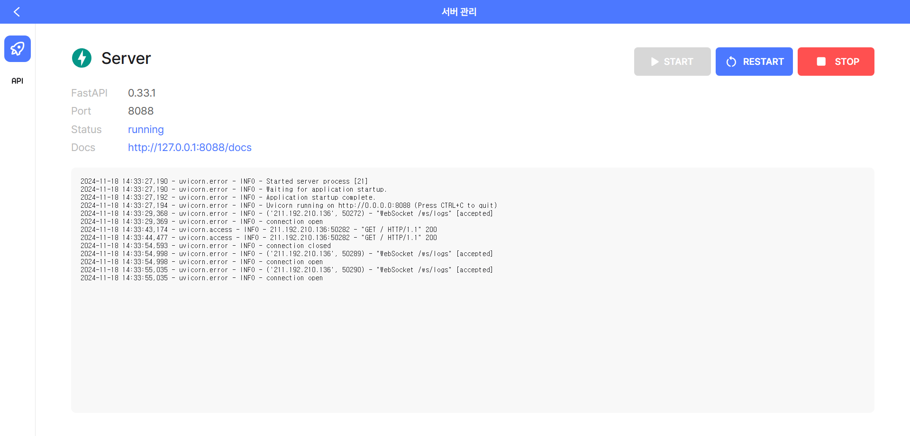

# 배포 페이지

배포 페이지에서는 FastAPI 서버의 상태를 관리하고, 실시간 로그를 확인할 수 있습니다. 아래는 배포 페이지의 구성 요소와 사용 방법에 대한 설명입니다.

---

## 배포 페이지 구성 요소

### 1. FastAPI 버전

현재 배포된 FastAPI 서버의 **버전 정보**가 표시됩니다. 배포된 서버가 최신 버전인지 확인할 수 있습니다.

### 2. 배포 서버 상태

배포 서버의 현재 상태를 나타냅니다. 상태는 다음과 같이 표시됩니다:

- **Running**: 서버가 정상적으로 실행 중입니다.
- **Stop**: 서버가 중지된 상태입니다.

### 3. 배포 포트

FastAPI 서버가 사용 중인 **포트 번호**를 표시합니다. 기본값은 **8088**입니다.

### 4. 관리 버튼

배포 상태를 관리하기 위해 다음 버튼이 제공됩니다:

- **Start**: 서버를 시작합니다. 서버가 실행 중이 아닌 경우 사용합니다.
- **Restart**: 서버를 재시작합니다.
- **Stop**: 서버를 중지합니다. 서버가 실행 중인 경우 사용합니다.

### 5. 실시간 로그

FastAPI 서버에서 발생하는 **실시간 로그**를 확인할 수 있습니다. 로그는 서버 상태를 모니터링하고, 오류를 디버깅하는 데 유용합니다.
